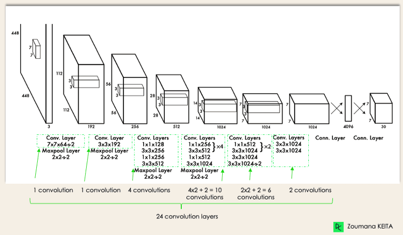
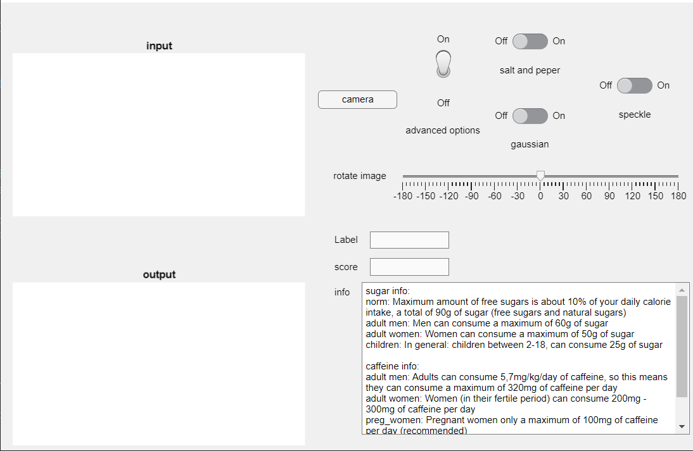

# Deep-Learning-Project-IHA

## Introduction

<!---TO DO-->

## Add-ons Matlab

These are the add-ons you need:

- Parallel computing toolbox
- MATLAB Support Package for USB Webcams
- Computer Vision Toolbox
- Image Processing Toolbox
- Deep Learning Toolbox
- Image Acquisition Toolbox
- Image Acquisition Toolbox Support Package for OS Generic Video Interface
- Deep Learning Toolbox model for ResNet50 network

### Add-on installation

To install the parallel computing toolbox, you'll will probably have problems finding the add-on. For this problem, you need to search for "parallel computing toolbox" and click on another add-on. There you will see that you can install the parallel computing toolbox that you need.

You could probably have the same problem with the "computer vision toolbox", therefore you can search for "computer vision toolbox", and click on another add-on.

If you installed every add-on, then your installed add-on window will look like this.

## Components

### Images

It was decided to train with 3 different cans: Coca-Cola, Fanta Orange and San Pellegrino Clementina. Of these cans pictures were taken (in .jpg format) from all sides and in different angles. There are between 260-300 pictures per can. These are the pictures that will be used to train the model.
Furthermore, there are two extra cans added to the image set which can be used to test the model, to see how it reacts on cans that were not included in the training.

## Model

### YOLO

For object detection using deep learning there are three widely used methods. Faster RCNN, YOLO and SSD. We decided to use YOLO as it is the fastest of the three methods. The downside with it being faster is that it loses some accuracy. For the training of the model we used a edited version of the code from the following guides

- [preprocessing guide](https://nl.mathworks.com/videos/data-preprocessing-for-deep-learning-1578031296056.html)
- [training guide](https://nl.mathworks.com/videos/design-and-train-a-yolov2-network-in-matlab-1578033233204.html)

To train the YOLO model we first had to label all of our data, we did this using the imageLabeler tool of matlab. In this tool we add the different labels: cola, fanta, sanPelligrino and then draw a bounding box around the object (can also be multiple objects) that can be found in the image. When finished the labeled data is saved as a groundTruth. At the end of the preprocessing we then convert this to a table that can be used as input for the training of our model.

For our training we changed the ... to adam, lowered the learning rate to 0.0001 and changed the mini-batch size to 8. Before training it is also important to change the anchors variable, this can be done using the AnchorBoxes file.

#### What is YOLO

YOLO is a real-time object detection algorithm. The authors of YOLO frame the object detection problem as a regression problem instead of a classification task by spatially separating bounding boxes and associating probabilities to each of the detected images using a single convolutional neural network (CNN).

#### Benefits of YOLO

- speed
- Detection accuracy
- lots of examples/documentation

We have chosen YOLO because it is a very fast object-detection algorithm that still has a pretty good detection accuracy. But most importantly we choose YOLO because it is widely used and documented. This means we could find way more examples then for e.g. RCNN.  

#### YOLO architecture

First the input layer is resized. Then there is a number of convolutional layers followed by two fully connected layers. To reduce the amount of layers/channels 1x1 convolution followed by 3x3 convolution. After the convolutional layers max-pooling is used.

#### How does the YOLO algorithm work

1. Residual blocks  
First the input image is divided into a grid of NxN. Each cell in the grid then has localize and predict the class of the object it covers along with a probability value.
2. Bounding box regression  
Next the bounding boxes that correspond to objects in the image need to be determined. YOLO determines the attributes of these bounding boxes using a single regression module in the following format, where Y is the final vector representation for each bounding box.
Y = [pc, bx, by, bh, bw, c1, c2]

- pc corresponds to the probability score of each grid that contains an object.  

- bx and by are the x and y coordinates of the center of the bounding box with respect to the enveloping grid cell.
- bh, bw correspond to the height and the width of the bounding box with respect to the enveloping grid cell.
- c1 and c2 correspond to the classes we are trying to detect. You can have as many classes as your use case requires.  

3. intersections over Unions or IOU  
In YOLO an object in an image can have multiple grid box candidates. The goal of the IOU is to discard grid boxes that are not relevant.
First the user has to define an IOU threshold which decides how high a prediction of a grid box has to be for it to be relevant. YOLO computes the IOU of each grid cell which is the Intersection area divided by the Union Area.

4. Non-Max Suppression or NMS  
Setting a threshold for the IOU is not always enough because an object can have multiple boxes with IOU beyond the threshold.  
This is where NMS can be used to only keep the boxes with the highest probability score of detection.

### ResNet50

#### Reasoning behind model choice

Had first chosen for squezeNet because it is one of the easiest models to mount and appy transfer learning.

#### SqueezeNet

After I was comfortable with it and obtained a tolerable result I started working with ResNet50, I applied the same layers to the output on ResNet50.

#### Using ResNet50

ResNet-50 is a convolutional neural network that is trained on more than a million images from the ImageNet database. As a result, the network has learned rich feature representations for a wide range of images. The network can classify images into 1000 object categories, such as keyboard, mouse, pencil, and many animals.

ResNet-50 is a 50-layer convolutional neural network (48 convolutional layers, one MaxPool layer, and one average pool layer). Residual neural networks are a type of artificial neural network (ANN) that forms networks by stacking residual blocks.

In Mathlab it has 177 layers in total, corresponding to a 50 layer residual network.

The network has an image input size of 224-by-224-by-3.

#### Benefits of ResNet50

1.Networks with large number (even thousands) of layers can be trained easily without increasing the training error percentage.

2.ResNets help in tackling the vanishing gradient problem using identity mapping.

The ResNet architecture follows two basic design rules. First, the number of filters in each layer is the same depending on the size of the output feature map. Second, if the feature map’s size is halved, it has double the number of filters to maintain the time complexity of each layer.

#### layers of ResNet50

The 50-layer ResNet architecture includes the following elements, as shown in the table below:

|Architecture    |  
|---|
|A 7×7 kernel convolution alongside 64 other kernels with a 2-sized stride.   |
|A max pooling layer with a 2-sized stride.  |  
|9 more layers—3×3,64 kernel convolution, another with 1×1,64 kernels, and a third with 1×1,256   |
|kernels. These 3 layers are repeated 3 times.   |
|12 more layers with 1×1,128 kernels, 3×3,128 kernels, and 1×1,512 kernels, iterated 4 times.   |
|18 more layers with 1×1,256 cores, and 2 cores 3×3,256 and 1×1,1024, iterated 6 times.   |
|9 more layers with 1×1,512 cores, 3×3,512 cores, and 1×1,2048 cores iterated 3 times.   |
| Average pooling, followed by a fully connected layer with 1000 nodes, using the softmax activation function.  |

The first thing I tested to start adjusting the network was to start adjusting the last three layers. The fully connected and class output where sufficient. Placed both on six outputs. Needed to remove the layers to be able to ajust the parameters.

Inside of ModelTransferLearning folder:

|Files   | Function  |
|---|---|
| test_model.m  | In this file we test the trained CNN  |  
| Adapt_for_cnn.m  | In this folder we change ur model to make it compatible for fast RCNN   |
| resNet_trained_1.mat |The model with all     |

#### Data augmentation

I tested the trained model with the 6 classes, it was almost a success, the cola can is recognised less,my reasoning was a  larger learning rate. There is an overfitting with the cola bottle over the cola Can. Letting it train for less time, drop out increase....  So have adjusted the model 0.0001 lr.
Got a validation dataset, that i select by myself with lots of noise and odd angles. It seems to work now when held in front of the camera in real time. Not all classes have the same number of pictures and it is not necessary, I also applied data augmentation.

#### Training ResNet50

Many times I did not have to train. I noticed with a low number of epochs 10. A miniBatchSize of 11 and a validation frequency of 6 obtained good results. I chose for a rotation between -90 degrees and 90 degrees. And a max scaling of 2.

#### Testing

For the moment it reacts better with an black background. The parameters i'm using to train the model are the next.

|parameters  | Function  | Value   |
|---|---|---|
| adam  | Main function for the training process  |   |
| learning rate|How fast we converagance to an result |0.001    |
| mean/average |The noise function  |  |

#### Link to dataset of images

https://vivesonline-my.sharepoint.com/:f:/r/personal/r0755466_student_vives_be/Documents/Data-foto%27s-deepl/NewDataset?csf=1&web=1&e=SQyhZf

#### Needed toolboxes (Add ons)
Deep Learning Toolbox
Deep Learning Toolbox model for ResNet50 network

## GUI

#### introduction

The Intent behind the GUI is the allow a user friendly experience for people with little to no knowledge of Matlab
and make it more attractive in general.

The GUI constist of two application , which are designed and programmed via the MATLAB app designer.
GUI which is the main app and miniGUI which is responsible for the live camera feed.

#### GUI

The GUI is where the user will receive all the information about the drink the model recognizes. 
- the name of the drink.
- the percentage of how sure the model is..
- and some health information about the drink or incase the model doesnt recognizes anything general healt information.

It also contains 4 advanced options to change the input image and see how that effects the model.
- add salt and pepper noise to the image.
- add gaussion to the image.
- add speckle noise to the image.
- the ability to rotate the image.

The two frame boxxes are self explanatory, they contain the input the model receives and output images the model returns.
And as last the camera button which open the miniGUI

#### miniGUI

When you press the camera button on the GUI it will activate the miniGUI and load in the two models in the startup.
The miniGUI is responible for running the model prediction on live camere feed , this allows the GUI the remain interactive and run smoothly.
it contains two options the YOLO model of the resnet50 model, which when selected will open a second screen to show the output in a bigger format.
The user is able the easily switch between the two options. 

#### quick examples

## Database

For the database there wasn't enough time to create one. So we made a json-file that consists of health information about how much sugar and caffeine an adult or a child can consume.
Then there is also a way to access the can with a specific ID, like "coca-cola". This ID has the ingredients of that specific can and how much of it you can drink, until you hit the limit of sugar and caffeine.

When trying to add the json-file to the GUI and read out the data, then Matlab couldn't get the data out of the file, because the data from the json file was read as different structs and was hard to access the different elements. So thats why we made different text-files and show these on the GUI.

The information about health was found on [gezondleven.be](https://www.gezondleven.be/themas/voeding/voedingsdriehoek) and the ingredients were found on the cans themselves.
